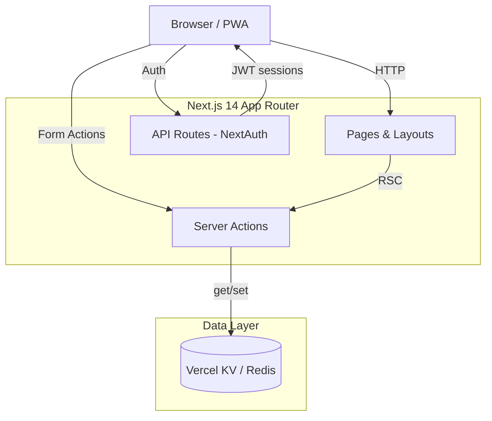
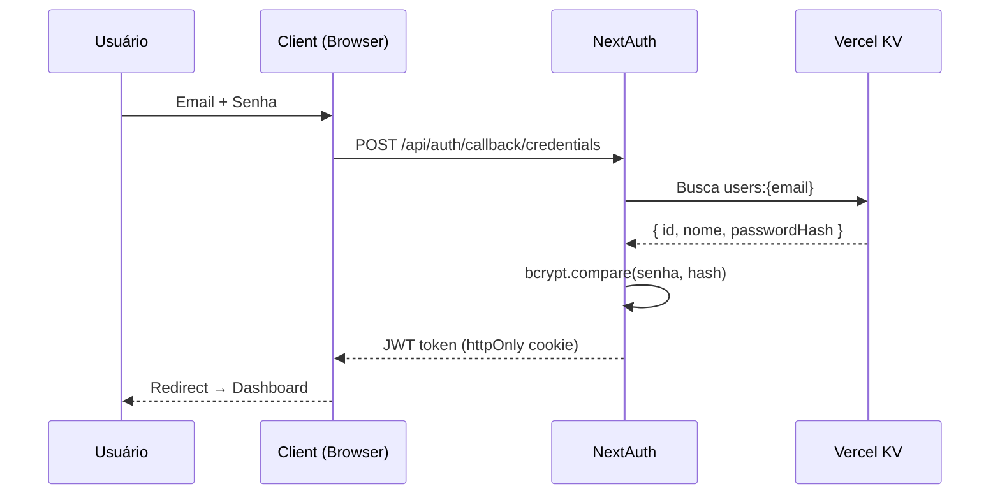
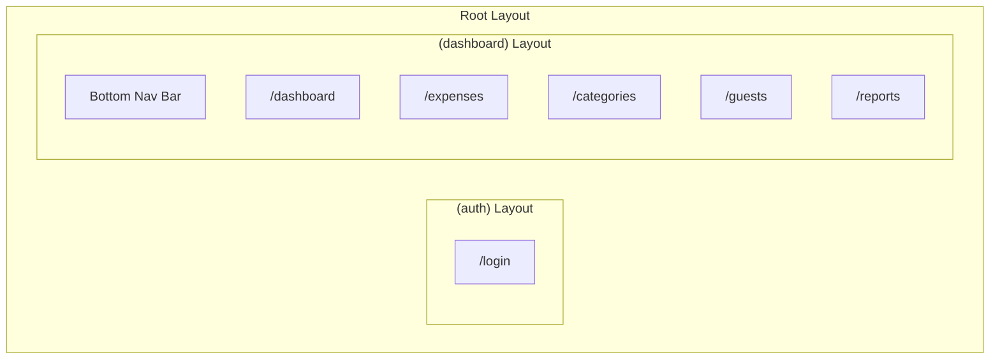

# Arquitetura — DivideAí

## Visão Geral



## Fluxo de Autenticação



## Componentes Principais

### Layout Structure



### Server Actions Flow

```
Client Component
  → Form submit / onClick
    → Server Action (src/app/actions/)
      → 1. auth() — verifica sessão
      → 2. schema.safeParse() — valida input
      → 3. kv.get/set() — operação no KV
      → 4. revalidatePath() — atualiza cache
    ← { success, data?, error? }
  ← UI update (optimistic ou revalidate)
```

## Decisões de Arquitetura

| Decisão | Motivo |
|---------|--------|
| App Router (não Pages) | Server Components, Server Actions, layouts aninhados |
| Vercel KV (não Postgres) | Zero infra, gratuito no hobby, suficiente para 2 usuários |
| JWT (não session DB) | Sem storage extra, 2 usuários = stateless é ideal |
| Server Actions (não API Routes) | Tipagem end-to-end, form progressive enhancement |
| shadcn/ui (não Material/Ant) | Customizável, copy-paste, sem bundle desnecessário |
| Dados por mês `{YYYY-MM}` | Queries eficientes, sem scan de toda a base |
